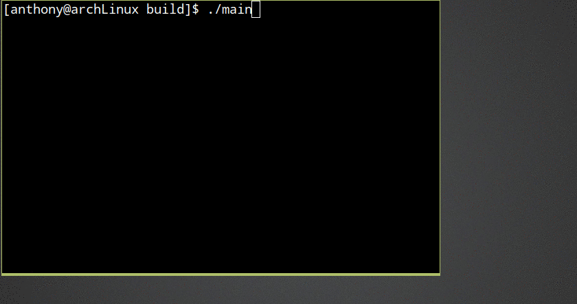
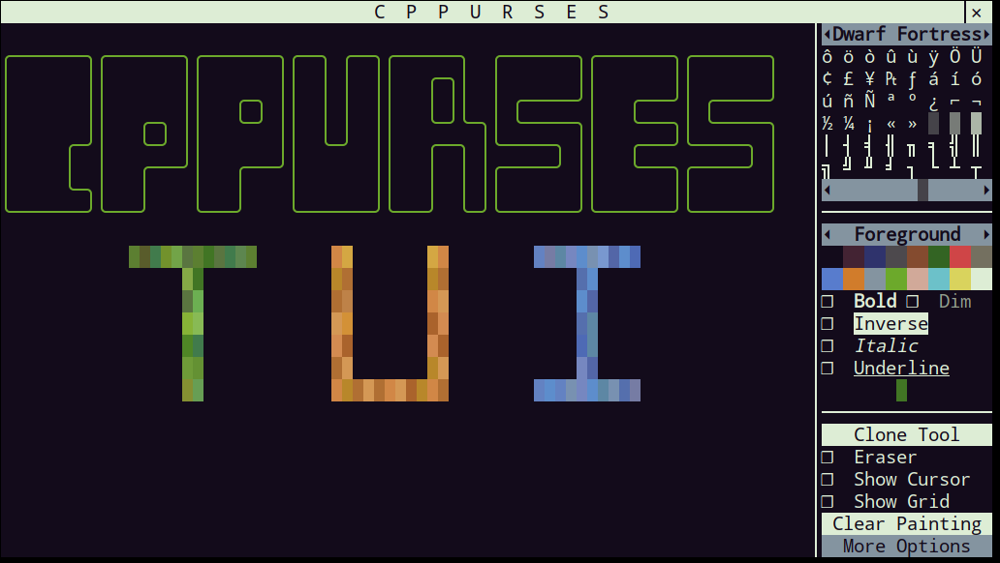
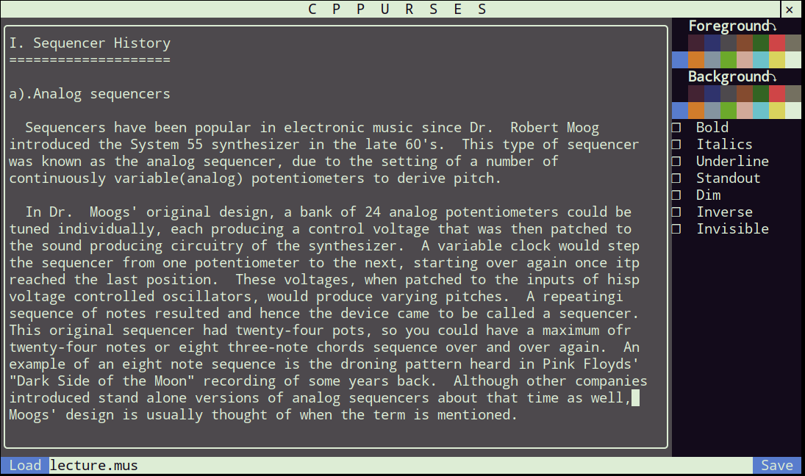

# TUI Library
__CPPurses__ is a Terminal User Interface Library built on top of
[ncurses](https://www.gnu.org/software/ncurses/). CPPurses defines
a framework of Widgets, Layouts and Events that make user input
and program output to the terminal simple and readable. The
library comes with a set of pre-built Widgets, though it is easy
to define new Widgets and to extend existing Widgets.

## Usage
### Defining a New Widget
```C++
#include <cppurses/cppurses.hpp>
#include <signals/signals.hpp>
#include <cstdint>
#include <utility>
using namespace cppurses;

// Button Widget that emits a signal when clicked.
class Button : public Widget {
   public:
    Button(Glyph_string title) : title_{std::move(title)} {}

    void set_title(Glyph_string title) {
        title_ = std::move(title);
        this->update();  // Post a Paint_event to the event queue.
    }

    // Signals
    sig::Signal<void()> clicked;

   protected:
    bool mouse_press_event(Mouse_button button,
                           Point global,
                           Point local,
                           std::uint8_t device_id) override {
        // Emit Signal if Left Button Pressed
        if (button == Mouse_button::Left) {
            clicked();
        }
        return Widget::mouse_press_event(button, global, local, device_id);
    }

    bool paint_event(Painter& p) override {
        // Calculate Center Position
        std::size_t x{(this->width() / 2) - (title_.length() / 2)};
        std::size_t y{this->height() / 2};
        Point position{x, y};

        // Put Title to Screen
        p.put(title_, position);

        return Widget::paint_event(p);
    }

   private:
    Glyph_string title_;
};

```
### Using Existing Widgets
```C++
struct Side_pane : public Vertical_layout {
    Textbox& tbox_mirror{this->make_child<Textbox>("Mirror")};
    Button& exit_btn{
        this->make_child<Button>(Glyph_string{"Exit", Attribute::Bold})};

    Side_pane() {
        enable_border(tbox_mirror);
        set_background(tbox_mirror, Color::Light_gray);
        set_foreground(tbox_mirror, Color::Dark_blue);

        exit_btn.height_policy.type(Size_policy::Fixed);
        exit_btn.height_policy.hint(3);
        set_background(exit_btn, Color::Dark_blue);
        set_foreground(exit_btn, Color::Light_gray);

        exit_btn.clicked.connect(System::quit);
    }
};

// Two Textboxes and Button to exit.
struct Two_boxes : public Horizontal_layout {
    Textbox& tbox{this->make_child<Textbox>()};
    Side_pane& side_pane{this->make_child<Side_pane>()};

    Two_boxes() {
        tbox.width_policy.stretch(2);
        tbox.text_changed.connect(slot::set_text(side_pane.tbox_mirror));
    }
};

int main() {
    System sys;

    Two_boxes main_widget;
    sys.set_head(&main_widget);
    Focus::set_focus_to(&main_widget.tbox);

    return sys.run();
}
```


## Modules
__Event System:__
Event loop, widget drawing, and user input.

__Signals and Slots:__
Widget to widget communication.

__Widget Library:__
Pre-made Widgets for reuse.

## Features
- UTF-8 support without the need for wide characters
- Extensible Color Palettes
- Mouse and Keyboard Input
- Simple and configurable layout system
- Easy border drawing and manipulation
- Vanilla C++ Signals and Slots implementation
- Fully featured Textbox widget with cursor movement and scrolling

## Widgets
- Textbox
- Text_display
- Checkbox
- Push_button
- Confirm_button
- Cycle_box
- Cycle_stack
- Titlebar
- Horizontal_scrollbar
- Vertical_scrollbar
- Color_select
- Glyph_select
- Label
- Labeled_cycle_box
- Line_edit
- List
- Log
- Menu
- Matrix_display
- Open_file
- Save_file
- Slider
- Status_bar
- Widget_stack
- Widget_stack_menu
- Horizontal_layout
- Vertical_layout

## Future Features
- Animation
- Mouse Move Events
- Tabs Widget
- Hovering Widget Layout
- Dialog Box Widget
- Documentation

## Installation
CPPurses depends on two header only libraries, this repo
includes them as git submodules. You'll need NCurses(>=6.0) installed
on your system.
```
git clone https://github.com/a-n-t-h-o-n-y/CPPurses.git
mkdir CPPurses/build && cd CPPurses/build
git submodule update --init --recursive --remote  # Pull in dependencies
cmake ..             # Generate Makefiles
make                 # Build library
make demos           # Build demos(optional)
make tests           # Build tests
sudo make install    # Install header and library archive to system defaults
```
For projects using CPPurses, link with cppurses, ncurses and pthreads.

## Documentation
Doxygen documentation can be found [here](
https://a-n-t-h-o-n-y.github.io/CPPurses/annotated.html).

## Demo Screenshots

Glyph Paint Demo


Notepad Demo


Chess Demo

## Tests
CPPurses uses google test.

## License
This software is distributed under the [MIT License](LICENSE.txt).
