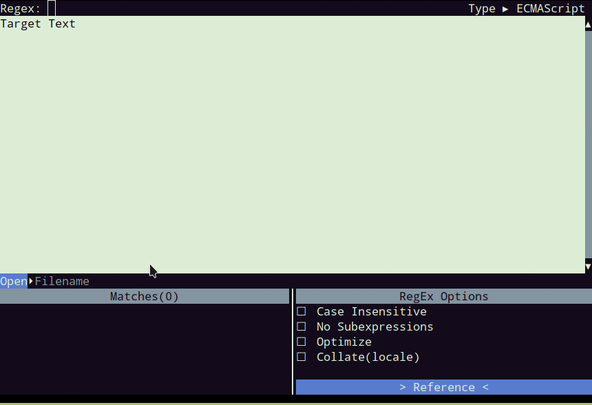
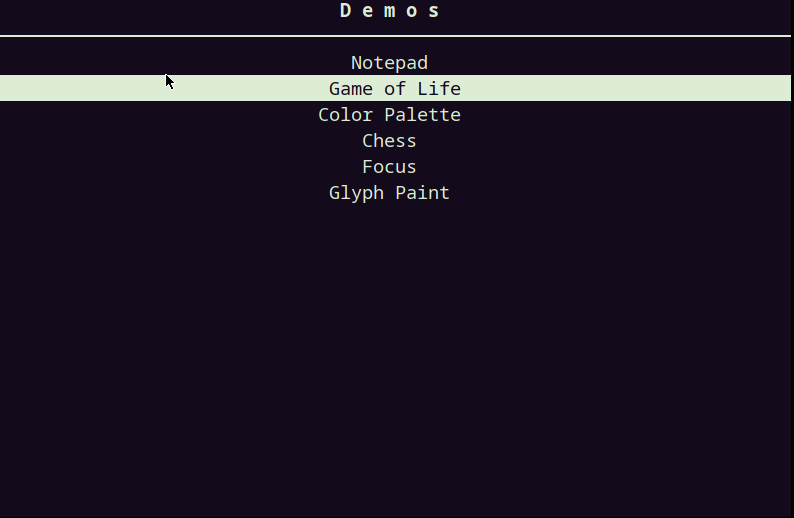
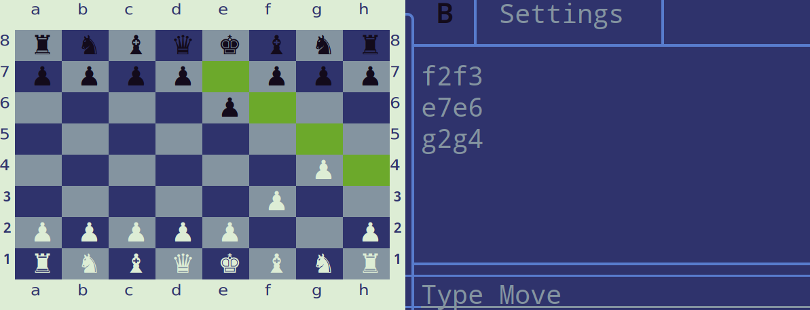
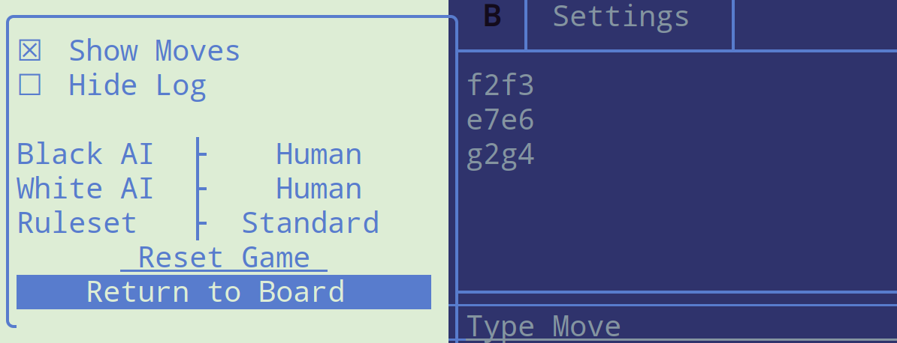

[](https://travis-ci.org/a-n-t-h-o-n-y/CPPurses) [](https://gitter.im/CPPurses/Lobby) [](https://github.com/a-n-t-h-o-n-y/CPPurses/wiki) [](https://a-n-t-h-o-n-y.github.io/CPPurses/hierarchy.html)


# TUI Library
__CPPurses__ is a Terminal User Interface(TUI) Library built on top of
[ncurses](https://www.gnu.org/software/ncurses/). It defines a framework of
[Widgets](https://github.com/a-n-t-h-o-n-y/CPPurses/wiki/Widgets),
[Layouts](https://github.com/a-n-t-h-o-n-y/CPPurses/wiki/Layouts), and
[Events](https://github.com/a-n-t-h-o-n-y/CPPurses/wiki/Events) that let you focus on
user interface design, while boilerplate common to ncurses applications is
handled behind the scenes.

CPPurses contains a collection of common Widgets that can be pieced together to
create a composite application. It is also possible to expand and build on top
of existing Widgets, or to create completely new Widget types, by overriding a
few virtual functions.

This is a __work in progress__. The API is not stable.

<p align="center">
  
</p>


## Usage
See the [wiki](https://github.com/a-n-t-h-o-n-y/CPPurses/wiki) for examples.

Reference documentation can be found [here](
https://a-n-t-h-o-n-y.github.io/CPPurses/annotated.html).

## Features
- Simple event system interface for handling mouse, keyboard
and animation events, among others.
- Library of commonly used Widget types.
- Widget reuse and expansion through inheritance.
- Layout Widgets which automatically resize and move their children.
- Signals and Slots for communication between Widgets.
- Extensible color palettes.
- Border drawing and customization.

## Build Instructions
CPPurses depends on two header only libraries, this repo
includes them as git submodules. You'll need NCurses installed on your system.
```
git clone https://github.com/a-n-t-h-o-n-y/CPPurses.git
mkdir CPPurses/build && cd CPPurses/build
git submodule update --init --recursive   # Pull in dependencies
cmake -DCMAKE_BUILD_TYPE=Release ..       # Generate Makefiles
make                                      # Build library
make demos                                # Build demos(optional)
sudo make install    # Install header and library archive to system defaults
```
Installing the library with CMake will place the headers and the library
archive in the standard GNU install directories.

## Using the Library
As a submodule:
```cmake
# CMakeLists.txt
cmake_minimum_required(VERSION 3.2)
add_executable(foo foo.cpp ...)

# CPPurses is cloned into a directory named external/
add_subdirectory(external/CPPurses)
target_link_libraries(foo cppurses)
```

As an installed library:
```cmake
# CMakeLists.txt
cmake_minimum_required(VERSION 3.2)
add_executable(foo foo.cpp ...)

# CPPurses is installed on your system and linker can find cppurses:
target_compile_features(foo PRIVATE cxx_std_14)
target_link_libraries(foo cppurses ncursesw pthread)
```

Without CMake, link with cppurses, ncursesw(or ncurses if ncursesw
is not availiable) and your system's thread library. If the library
is installed your linker flags will be something like:
```
-lcppurses -lncursesw -pthread
```
C++14 or above will need to be used.

## License
This software is distributed under the [MIT License](LICENSE.txt).

## Gallery
Game of Life
<p align="center">
  
</p>

Chess
<p align="center">
  
</p>
<p align="center">
  
</p>
