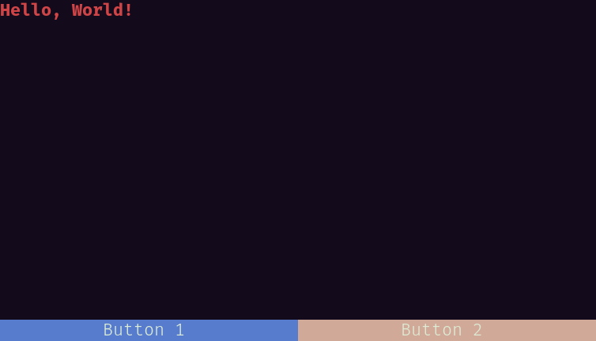

[](https://github.com/a-n-t-h-o-n-y/CPPurses/actions?query=workflow%3Abuild)
[](docs/manual/index.md)
[](https://a-n-t-h-o-n-y.github.io/CPPurses/hierarchy.html)

# Terminal User Interface Library

__CPPurses__ is a C++17 Terminal User Interface(TUI) Library built on top of
[ncurses](https://www.gnu.org/software/ncurses/). It defines a framework of
Widgets, Layouts, and Events that let you work at a high level of abstraction,
keeping ncurses boilerplate to the framework internals.

CPPurses contains a collection of common Widget and Layout types that can be
pieced together to create a composite application. It is also possible to expand
and build on top of existing Widgets, or to create completely new Widget types
by overriding a few virtual functions.

This is a __work in progress__. The API is not stable.

<!-- TODO - single gif of multiple demos -->
<p align="center">
  
</p>

## Usage

```cpp
#include <cppurses/cppurses.hpp>

int main()
{
    using namespace cppurses;
    auto app_ptr =
        layout::vertical(
            textbox("Hello, World!" | foreground(Color::Red) | Trait::Bold) | pipe::name("tb"),
            layout::horizontal<Button>(
                button("Button 1") | pipe::bg(Color::Blue) | pipe::name("b1"),
                button("Button 2") | pipe::bg(Color::Violet) | pipe::name("b2")
            ) | pipe::fixed_height(1)
        );
    auto& tb = app_ptr->find_child_by_name("tb");
    app_ptr->find_child_by_name("b1") | pipe::on_press([&tb]{ tb.append("Button 1 Pressed"); });
    app_ptr->find_child_by_name("b2") | pipe::on_press([&tb]{ tb.append("Button 2 Pressed"); });
    return System{}.run(*app_ptr);
}
```

<p align="center">
  
</p>

See the [Manual](docs/manual/index.md) for more in depth explanations and
examples.

Reference documentation can be found
[here](https://a-n-t-h-o-n-y.github.io/CPPurses/hierarchy.html).

## Features

- Simple event system interface for handling mouse, keyboard and animation
  events, among others
- Library of commonly used Widget types
- Signals and Slots for communication between Widgets

<!-- TODO -->
- Widget reuse and expansion x
- Layout Widgets which automatically resize and move their children
- Extensible color palettes and dynamic colors
- Border drawing and customization
- Animation

## Build Instructions

CPPUrses depends on a Signals library and ncurses, these are both included as
git submodules.

```
git clone https://github.com/a-n-t-h-o-n-y/CPPurses.git
mkdir CPPurses/build && cd CPPurses/build
git submodule update --init --recursive   # Pull in dependencies
cmake -DCMAKE_BUILD_TYPE=Release ..       # Generate Makefiles
make                                      # Build library
make demos                                # Build demos(optional)
```

Installing the library with CMake will place the headers and the library
archive in the standard GNU install directories.

## Using the Library

It is recommended to clone this library into your project and use it as a
submodule, rather than installing it to your system. This way you can lock each
application to a specific version of CPPurses.

CMake will add the library target `cppurses` if you add the CPPurses directory
with `add_subdirectory(...)`.

```cmake
# CMakeLists.txt
cmake_minimum_required(VERSION 3.2)
add_executable(my_app
                my_app.main.cpp
                ...
)

# CPPurses is cloned into a directory named external/
add_subdirectory(external/CPPurses)
target_link_libraries(foo cppurses)
```

## License
This software is distributed under the [MIT License](LICENSE.txt).
