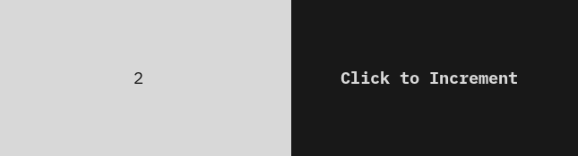

# TermOx II 🐂🐂

**TermOx** is a C++20 library for creating rich, interactive terminal user interfaces 
with minimal code.

- [📚 Getting Started](docs/getting_started.md)
- [📖 Reference](docs/reference.md)
- [💻 Examples](examples)

## Quick Example

<p align="center">
  
</p>

```cpp
#include <ox/ox.hpp>
using namespace ox;

int main()
{
    auto head = Label{{
                    .text  = "C++20 Terminal UI Framework",
                    .align = Align::Center,
                    .brush = {.foreground = XColor::Blue, .traits = Trait::Bold},
                }} | Border{.box = shape::Box::round(), .label = "TermOx II"};

    return Application{head}.run();
}
```

📂 Explore more in the [examples](examples) directory.

Use [scratch.cpp](examples/scratch.cpp) and the `TermOx.examples.scratch` build target
to try out the library quickly.

## Features

### Core Capabilities
- **Flexible Layout System** - Size policies and automatic sizing
- **Event-Driven Architecture** - Clean handling of user input and system events
- **Signal/Slot System** - Based on [Signals Light](https://github.com/a-n-t-h-o-n-y/signals-light)
- **Timer Support** - Periodic actions with timer events
- **Custom Widgets** - Create your own widgets with ease

### Rich Terminal Styling
- **Colors** - Full RGB, HSL, and [XTerm 256 Color](https://jonasjacek.github.io/colors/) support
- **Text Styling** - Bold, italic, underline, strikethrough, and more
- **Unicode Support** - Wide character and multi-byte encoding compatibility

### Input Handling
- **Keyboard** - Key press/release events, modifiers, and special keys
- **Mouse** - Click, scroll, movement, and enter/leave events
- **Focus Management** - Tab navigation, mouse click, and focus events

### Widget Library
- **Core Widgets** - Labels, buttons, text inputs, checkboxes, radio buttons, data
tables and more
- **Layout Widgets** - Horizontal, vertical, and suspended layouts

## Build Instructions

**TermOx** uses [CMake](https://cmake.org/) to generate build targets.

    git clone https://github.com/a-n-t-h-o-n-y/TermOx.git
    mkdir TermOx/build && cd TermOx/build
    cmake ..
    make TermOx

Dependencies ([Signals Light](https://github.com/a-n-t-h-o-n-y/signals-light),
[zzz](https://github.com/a-n-t-h-o-n-y/zzz), and
[Escape](https://github.com/a-n-t-h-o-n-y/Escape)) are automatically fetched by CMake.

## Note on Version 2

Version 2 is a complete rewrite of the library. It focuses on providing a simpler set of
base widgets and a light-weight core implementation of events processing and rendering.
As such, the API has little in common with the previous version.

## A Second Example

<p align="center">
  
</p>

```cpp
#include <ox/ox.hpp>
using namespace ox;

// Counter Button + Label
int main()
{
    auto counter = Row{
        IntegerLabel{{
            .value = 0,
            .align = Align::Center,
            .brush = {.background = XColor::White, .foreground = XColor::Black},
        }},
        Button{{
            .text = "Click to Increment",
            .align = Align::Center,
            .brush = {.background = XColor::Black,
                      .foreground = XColor::White,
                      .traits = Trait::Bold},
            .press_mod = [](Label& l) { l.brush.foreground = XColor::Yellow; },
        }},
    };

    auto& [label, button] = counter.children;

    // Signals and Slots
    Connection{
        .signal = button.on_press,
        .slot = [](IntegerLabel& l) { ++l.value; },
    }(label);

    return Application{counter}.run();
}
```

## Gallery

<p align="center">
  
</p>
<p align="center">
  
</p>
<p align="center">
  
</p>
<p align="center">
  
</p>
<p align="center">
  
</p>
<p align="center">
  
</p>

## Contributing

Contributions are welcome! Please feel free to submit a Pull Request.

## License

This project is licensed under the MIT License - see the [LICENSE](LICENSE) file for
details.
