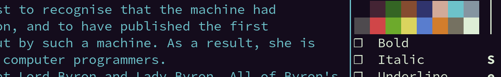
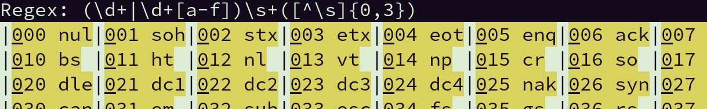
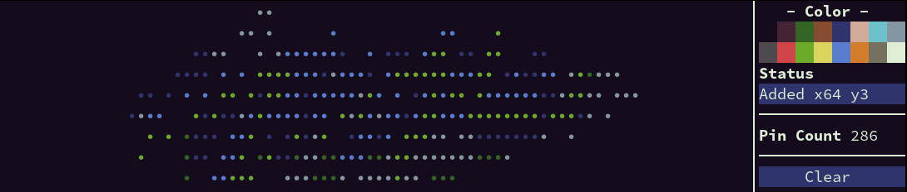

[](https://github.com/a-n-t-h-o-n-y/TermOx/actions?query=workflow%3Abuild)
[](docs/manual/index.md)
[](https://a-n-t-h-o-n-y.github.io/TermOx/hierarchy.html)

# TermOx 🐂

**TermOx** is a Terminal User Interface(TUI) Framework written in  C++17. Built
on top of [Escape](https://github.com/a-n-t-h-o-n-y/Escape), it defines a set of
Widgets, Layouts, and Events that make it quick to craft unique user interfaces
in the terminal.

## Widget Library

<p align="center">
  
</p>

The TermOx [Widget Library](docs/manual/widget.md#widget-library) contains a
handful of common Widget and Layout types. These are often the building blocks
for significant portions of an application's TUI.

The library Widgets attempt to be generic enough for most use cases. Template
parameters allow for slight variantions of the same Widget, many of the
most common variations are provided as named type aliases.

## Layouts

<p align="center">
  
</p>

Widgets are glued together via Layouts, the three Layout types provided by
TermOx are `Vertical`, `Horizontal`, and `Stack`. Layouts are themselves Widgets
that are able to hold other Widgets, they provide the logic for enabling,
resizing, and placement of each of their child Widgets.

Common Layout patterns are encapsulated in the generic `Pair`, `Tuple`, and
`Array` class templates; organizing Widgets is as simple as listing Widget types
in order, or the number of Widgets of a specific type, as in the case of
`Array`.

## Colors

<p align="center">
  
</p>

TermOx Color Palettes support full true color with RGB and HSL values, [XTerm
256 color indices](https://jonasjacek.github.io/colors/), and Dynamic Colors.

Color Palettes define a set of names and color values. Palettes can be set at
runtime, giving applications a simple way to implement color schemes.

Dynamic Colors are animated colors. Their definition changes over time, and they
can be assigned to a any color name in a Palette.

Not all terminals support true color or the complete 256 colors defined by
XTerm.

## Interactivity

<p align="center">
  
</p>

Mouse and Keyboard input is fully supported. Widgets are able to handle Events,
update their state and re-paint themselves.

Mouse input supports up to 11 mouse buttons(including scrolling), modifier
keys(`shift`, `ctrl`, `alt`), mouse click and drag, and always-on mouse
movement.

Keyboard input supports all printable and non-printable keyboard/keypad presses
and modifier keys(`shift`, `ctrl`, `alt`, `meta`).  Signals generated by special
key presses(`Ctrl+c`, `Ctrl+z`, etc...) can be supressed by TermOx and sent to
Widgets as key combinations.

Most(but not all) terminals support mouse movement. Some terminals intercept
modifier keys for their own purposes.

## Animation

<p align="center">
  
</p>

Each Widget is capable of Animation via Timer Events.  Overriding the
`timer_event` handler lets the Widget update its state and repaint itself.

Color definitions can be animated with Dynamic Colors.

## Custom Widgets

<p align="center">
  
</p>

Beyond the Widget Library, anyone can create new Widgets from scratch. By
inheriting from the `Widget` class, you are provided with virtual function event
handlers. These allow handling of everything from user input, animation,
painting the screen, focus in/out, etc... Inheriting from an existing Widget
type lets you build on top of existing behavior.

## Signals

TermOx uses the [Signals Light](https://github.com/a-n-t-h-o-n-y/signals-light)
library to facilitate communication between Widgets. Signals are added to
Widgets as members and emitted at anytime to notify registered observers, along
with any data sent when emitted.

All event handlers(mouse, keyboard, etc...) have a cooresponding Signal emitted
on the event, these can be connected to for a more reactive style of
programming.

<p align="center">
  
</p>

## Build Instructions

TermOx depends on the [Signals
Light](https://github.com/a-n-t-h-o-n-y/signals-light) and
[Escape](https://github.com/a-n-t-h-o-n-y/Escape) libraries, these are both
included as git submodules.

    git clone https://github.com/a-n-t-h-o-n-y/TermOx.git
    mkdir TermOx/build && cd TermOx/build
    git submodule update --init --recursive   # Pull in dependencies
    cmake .. -DCMAKE_BUILD_TYPE=Release       # Generate Makefiles
    make                                      # Build library
    make demos                                # Build demos(optional)
    make termox.unit.tests                    # Build Unit Tests(optional)
    make termox.ui.tests                      # Build UI Tests(optional)
    make install                              # Install to system directories(optional)

Try out the `./demos/demos` app to get a feel for what TermOx is capable of.

## Using the Library

It is recommended to clone this library into your project and use it as a
submodule rather than installing it to your system. This way you can lock your
application to a specific version of TermOx.

CMake will add the library target `TermOx` if you add the TermOx directory
with `add_subdirectory(...)`.

```cmake
# CMakeLists.txt
cmake_minimum_required(VERSION 3.2)
add_executable(my_app
               ...
               my_app.main.cpp
)

# If TermOx is cloned into a directory named external/
add_subdirectory(external/TermOx)
target_link_libraries(my_app TermOx)
```

## Code Example

### Custom Widget

This code creates a new Widget type from scratch. It is a simple `Pinbox` Widget
that lets a user place pins of various colors on a dark background, much like a
Lite-Brite toy.

```cpp
#include <map>
#include <string>

#include <termox/termox.hpp>

using namespace ox;

class Pinbox : public Widget {
   public:
    // Emitted when a new pin is inserted.
    sl::Signal<void(Point)> pin_inserted;

    // Emitted when an existing pin is removed.
    sl::Signal<void(Point)> pin_removed;

   public:
    Pinbox()
    {
        using namespace ox::pipe;
        *this | on_mouse_press([&](auto const& m) { this->handle_mouse(m); })
              | on_mouse_move ([&](auto const& m) { this->handle_mouse(m); })
              | on_paint([&](Painter& p) {
                  for (auto [xy, color] : points_)
                      p.put(U'•' | fg(color), xy);
              });
    }

   public:
    // Set the Color for newly inserted pins.
    void set_foreground(Color c) { foreground_ = c; }

    // Remove all pins from the screen.
    void clear_screen() { points_.clear(); this->update(); }

   private:
    std::map<Point, Color> points_;
    Color foreground_ = Color::Light_blue;

   private:
    // Inserts pin at Point p, if p is empty; emits pin_inserted Signal.
    void insert_pin(Point p)
    {
        auto const [_, inserted] = points_.insert({p, foreground_});
        if (inserted) {
            pin_inserted.emit(p);
            this->update();  // Post a Paint Event
        }
    }

    // Removes pin at Point p, if it exists; emits pin_removed Signal.
    void remove_pin(Point p)
    {
        auto const count = points_.erase(p);
        if (count != 0) {
            pin_removed.emit(p);
            this->update();  // Post a Paint Event
        }
    }

    void handle_mouse(Mouse const& m)
    {
        switch (m.button) {
            case Mouse::Button::Left: this->insert_pin(m.at); break;
            case Mouse::Button::Right: this->remove_pin(m.at); break;
            default: break;
        }
    }
};

```

There are two styles of building applications in Termox; with types or values.
The next two sections demonstrate building up an application around the `Pinbox`
Widget. Each section produces the exact same user interface.

### Building with Types

This first section creates new Widget types to build up the interface.

```cpp
using namespace ox;

class Side_pane : public VTuple<HLabel,
                                Color_select,
                                HLabel,
                                Text_view,
                                HLine,
                                HPair<HLabel, Int_view>,
                                HLine,
                                Confirm_button,
                                Widget> {
   public:
    HLabel& color_label        = this->get<0>();
    Color_select& color_select = this->get<1>();
    HLabel& status_label       = this->get<2>();
    Text_view& status_box      = this->get<3>();
    HLabel& count_label        = this->get<5>().first;
    Int_view& count_box        = this->get<5>().second;
    Confirm_button& clear_btn  = this->get<7>();
    Widget& empty_space        = this->get<8>();

   public:
    Side_pane()
    {
        using namespace ox::pipe;

        *this | fixed_width(16);

        color_label  | align_center() | text("- Color -" | Trait::Bold);
        color_select | fixed_height(2);
        status_label | text("Status" | Trait::Bold);
        status_box   | fixed_height(1) | bg(Color::Dark_blue);
        this->get<5>() | fixed_height(1);
        count_label | text("Pin Count" | Trait::Bold) | fixed_width(10);
        count_box   | value(0);
        clear_btn.main_btn | text("Clear") | bg(Color::Dark_blue);
    }
};

struct Pinbox_app : HPair<Pinbox, Passive<Bordered<Side_pane>>> {
    Pinbox& pinbox       = this->first;
    Side_pane& side_pane = this->second | pipe::take_west() | pipe::wrapped();

    Pinbox_app()
    {
        using namespace ox::pipe;
        using std::to_string;
        auto& status_box = side_pane.status_box;
        auto& count_box  = side_pane.count_box;

        side_pane.color_select.color_selected.connect([&](Color c) {
            pinbox.set_foreground(c);
            status_box | text(color_to_string(c) + " Set");
        });

        side_pane.clear_btn.pressed.connect([&] {
            pinbox.clear_screen();
            count_box  | value(0);
            status_box | text("Screen Cleared");
        });

        pinbox.pin_inserted.connect([&](Point at) {
            count_box  | value(count_box.value() + 1);
            status_box | text("Added x" + to_string(at.x) + " y" + to_string(at.y));
        });

        pinbox.pin_removed.connect([&](Point at) {
            count_box  | value(count_box.value() - 1);
            status_box | text("Removed x" + to_string(at.x) + " y" + to_string(at.y));
        });
    }
};

int main() { return System{Mouse_mode::Drag}.run<Pinbox_app>(); }
```

### Building with Values

This next section produces the same interface as the one above, but uses
existing Widget objects and modifies them to build up the interface.

```cpp
auto pinbox_app()
{
    using namespace ox;
    using namespace ox::pipe;
    auto pa =
        hpair(
            std::make_unique<Pinbox>(),
            bordered(vtuple(
                hlabel("- Color -" | Trait::Bold) | align_center(),
                color_select() | fixed_height(2),
                hlabel("Status" | Trait::Bold),
                text_display() | fixed_height(1) | bg(Color::Dark_blue),
                hline(),
                hpair(
                    hlabel("Pin Count" | Trait::Bold) | fixed_width(10),
                    int_view(0)
                ) | fixed_height(1),
                hline(),
                confirm_button("Clear"),
                widget()
            ) | fixed_width(17)) | take_west()
        );

    auto& pinbox       = pa->first;
    auto& color_select = pa->second.wrapped.get<1>();
    auto& status_box   = pa->second.wrapped.get<3>();
    auto& count_box    = pa->second.wrapped.get<5>().second;
    auto& clear_btn    = pa->second.wrapped.get<7>();

    clear_btn.main_btn | bg(Color::Dark_blue);

    color_select.color_selected.connect([&](Color c) {
        pinbox.set_foreground(c);
        status_box | text(color_to_string(c) + " Set");
    });

    clear_btn.pressed.connect([&] {
        pinbox.clear_screen();
        count_box | value(0);
        status_box | text("Screen Cleared");
    });

    using std::to_string;
    pinbox.pin_inserted.connect([&](Point at) {
        count_box | value(count_box.value() + 1);
        status_box | text("Added x" + to_string(at.x) + " y" + to_string(at.y));
    });

    pinbox.pin_removed.connect([&](Point at) {
        count_box | value(count_box.value() - 1);
        status_box |
            text("Removed x" + to_string(at.x) + " y" + to_string(at.y));
    });

    return pa;
}

int main() { return System{Mouse_mode::Drag}.run(*pinbox_app()); }
```

Although this style is a bit less verbose than the typed style, it is limited in
that it cannot add named data. If you need to hold an `int count;` variable that
multiple Widgets access, you need a new Widget type that owns that variable.

<p align="center">
  
</p>

See the [Manual](docs/manual/index.md) for more in depth explanations and
examples.

Reference documentation can be found
[here](https://a-n-t-h-o-n-y.github.io/TermOx/hierarchy.html).

This project was previously named **CPPurses**.

## License

This software is distributed under the [MIT License](LICENSE.txt).
