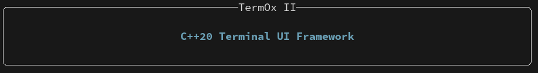
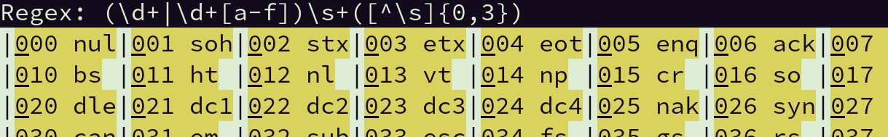
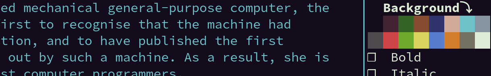
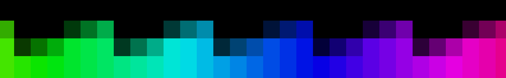
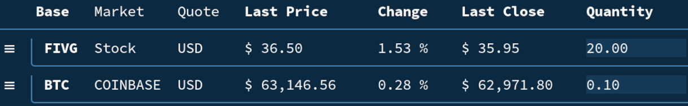
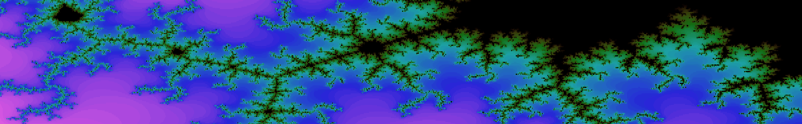

# TermOx II 🐂🐂

**TermOx** is a C++20 Terminal User Interface Library.

- [Guide](docs/guide.md)
- [Reference](docs/reference.md)
- [Examples](examples)

----

<p align="center">
  
</p>

```cpp
#include <ox/ox.hpp>
using namespace ox;

int main()
{
    auto head = Label{{
                    .text  = "C++20 Terminal UI Framework",
                    .align = Align::Center,
                    .brush = {.foreground = XColor::Blue, .traits = Trait::Bold},
                }} | Border{.box = shape::Box::round(), .label = "TermOx II"};

    return Application{head}.run();
}
```

See the [examples](examples) directory for more sample code.

Use [scratch.cpp](examples/scratch.cpp) and the `TermOx.examples.scratch` build target
to try out the library.

## Features

- Colors - RGB, HSL, [XTerm 256 Color Indices](https://jonasjacek.github.io/colors/)
- Traits - Bold, Italic, Underline, etc...
- Layouts and Size Policies
- Events
    - Mouse Input - Mouse Move, Wheel, etc...
    - Keyboard Input
    - Focus In / Out
    - Timer
- [Signals](https://github.com/a-n-t-h-o-n-y/signals-light) 
- Widget Library

## Build Instructions

**TermOx** uses [CMake](https://cmake.org/) and depends on the [Signals
Light](https://github.com/a-n-t-h-o-n-y/signals-light), [zzz](https://github.com/a-n-t-h-o-n-y/zzz) and
[Escape](https://github.com/a-n-t-h-o-n-y/Escape) libraries, which are all fetched by cmake automatically.

    git clone https://github.com/a-n-t-h-o-n-y/TermOx.git
    mkdir TermOx/build && cd TermOx/build
    cmake ..
    make TermOx

## Note on Version 2

Version 2 is a complete rewrite of the library. It focuses on providing a simpler set of
base widgets and a light-weight core implementation of events processing and rendering.
As such, the API has little in common with the previous version.

## Gallery

<p align="center">
  
</p>
<p align="center">
  
</p>
<p align="center">
  
</p>
<p align="center">
  
</p>
<p align="center">
  
</p>
<p align="center">
  
</p>